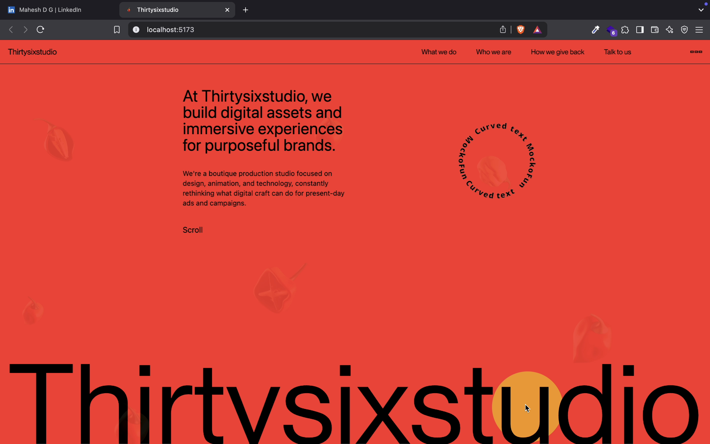
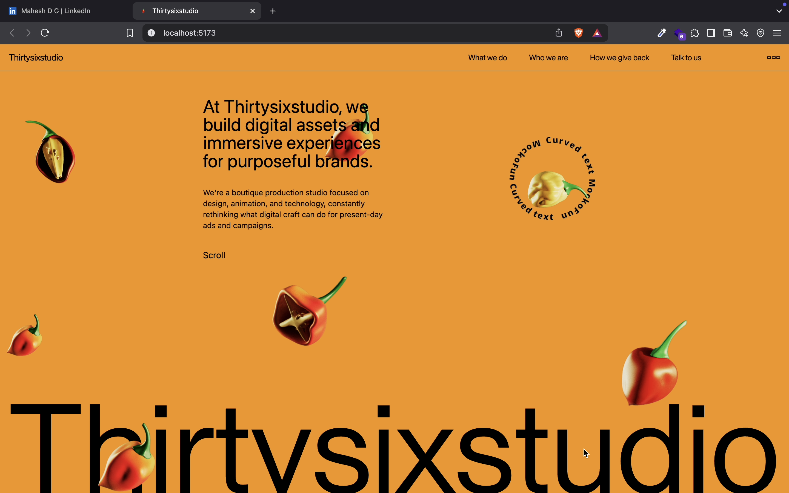
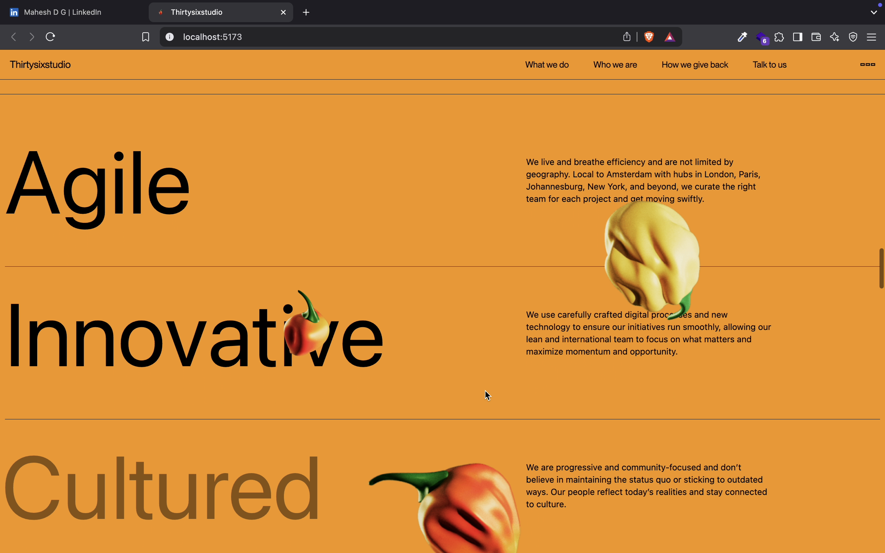
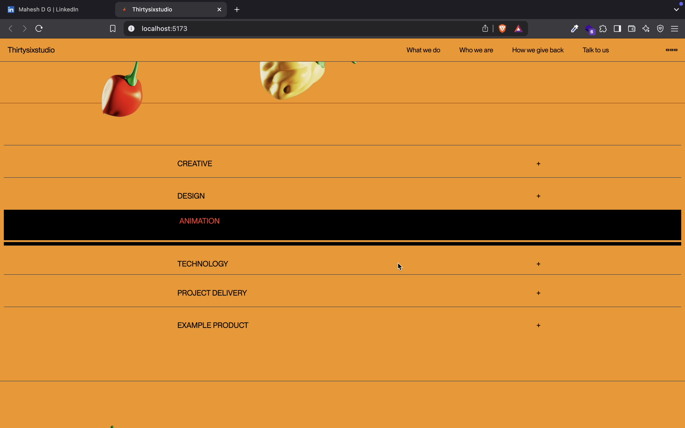
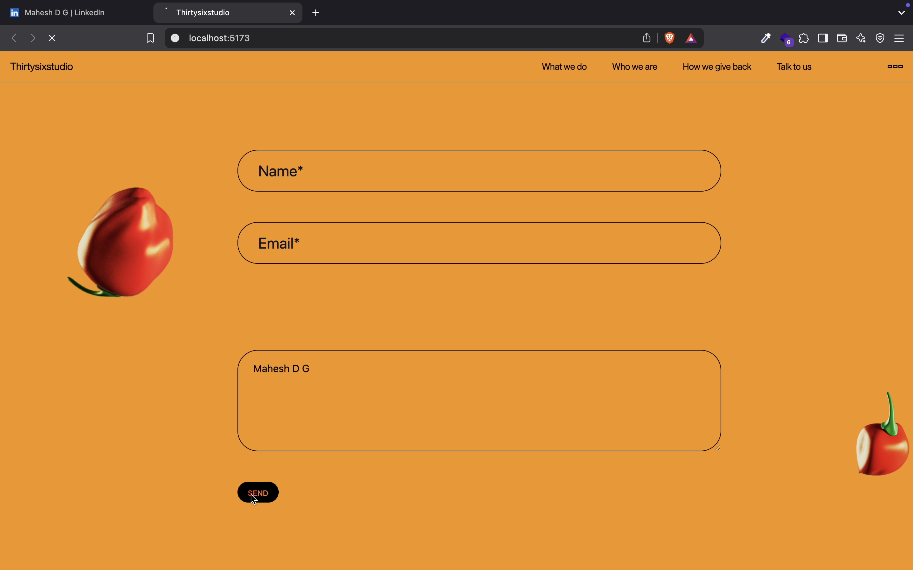

# ThirtySix Studio Clone 🚀

😳 **AI Used for This Floating Canvas Effect!**  
I just completed cloning ThirtySix Studio using **React, GSAP, Framer Motion, Tailwind** – and AI made it crazy fast & easier! 😍🔥

This website is really 🌶️ 🥵 AI can do it even faster, but no worries 😎🥤 – I took my time to match animations & hover effects and completed all the pages myself.  
This is one of the most fun projects I’ve built! **I NEED MORE projects like this!** 🤩

## 🔗 Live Demo

👉 [Live Demo](https://thirtysixstudio-woad.vercel.app/)

## 🎥 Special Thanks

Massive thanks to **Sheryians Coding School** for teaching these incredible floating effects!  
Here’s their YouTube tutorial link 🎥: [ https://youtu.be/5WDNHl-x-AM?si=j26syEnrRrq_Xdpi ]

---

## 📸 Screenshots

### 🏠 Homepage

### 🎨 Canvas Effect

### 🔥 Animations

### ✅ Final Look

---

## 🛠️ Tech Stack

- **React** ⚛️
- **GSAP** ✨
- **Framer Motion** 🎭
- **Tailwind CSS** 🎨
- **AI Assisted Effects** 🤖
